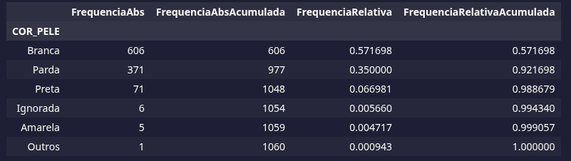
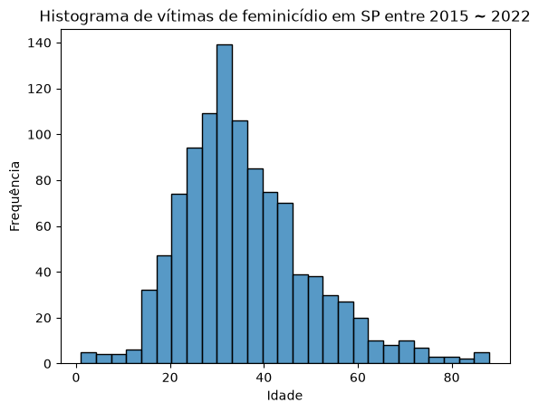
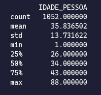
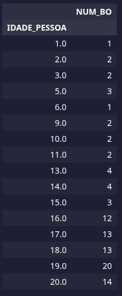
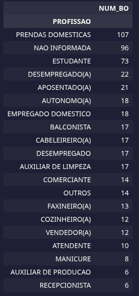
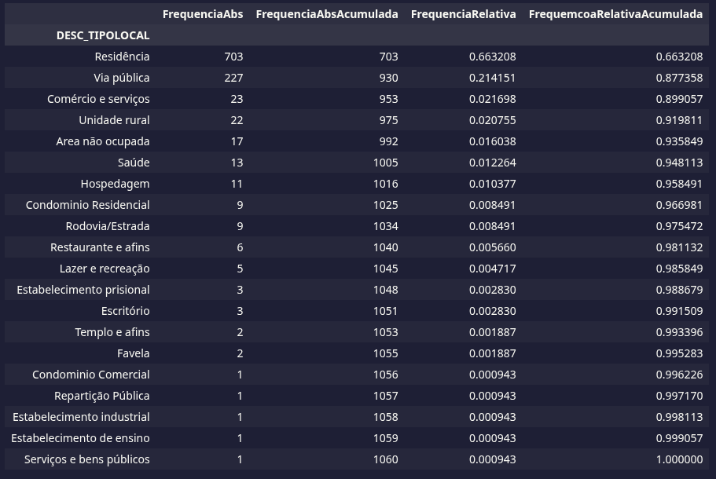
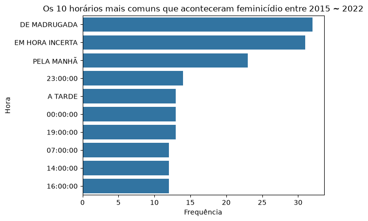
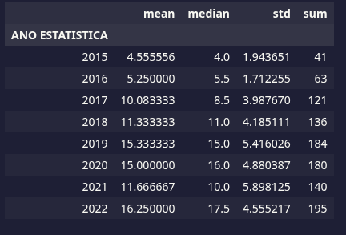

# Trabalho Tratamento da informação e Probabilidade I

O objetivo desse trabalho é realizar uma análise descritiva dos dados da SSP sobre feminicídio.

[Link dos dados](https://www.kaggle.com/datasets/matheusalmeida02/feminicidios-ssp/data)

## Disclamer
Os dados das vítimas da SSP começam em 2015 e vai até 2022, por isso que análise começa em 2015 e vai até apenas em 2022.

## Reports

#### Cor das vítimas
Podemos então definir uma pergunta simples, entre 2015 e 2022 morreram mais mulheres de que cor?

Podemos reparar que o maior número de homicídios entre esses anos foi de mulheres brancas, ocupando mais de 50% dos dados, mais precisamente 57,17%. Podemos perceber que pessoas Pardas e Pretas têm uma taxa de aproximadamente 41,7%. Olhando a última coluna, podemos notar que essas três cores mencionadas tem uma taxa de 98,87%.

#### Faixa etária das vítimas
Qual a faixa etária das vítimas nesse período? 

Podemos observar que a distribuição se aproxima de uma distribuição normal. Vamos calcular as estatística e descobrir mais coisas sobre essa distribuição.

Podemos observar que em média, as mulheres mortas, eram de 35,83 anos de idade, ou seja, aproximadamente 36 anos. Também outro fato é que 50% do conjunto é composto de mulheres com menos de 35 anos e 75% dos dados com menos de 45 anos. 
Observamos que houve 1052 registros de feminicídio, porém com desvio padrão até baixo para esse volume de dados.
Olhando novamente para o histograma, podemos notar que temos alguns dados de mulheres com menos de 20 anos de idade. Vamos realizar um filtro nesses dados e observar.

Os dados nós mostram que nem as crianças escapam do crime, inclusive, uma de 1 ano de idade apenas.

#### Profissão
O conjunto fornece dados da profissão das pessoas, vamos listar elas.

A imagem mostra as 20 primeiras profissões, podemos observar que a profissão “prendas domésticas” está no topo. Procurando a definição no Michaelis Online sobre prendas domésticas, encontramos:

“conjunto de habilidades e conhecimentos que se espera encontrar em um indivíduo, geralmente do sexo feminino, que cuida dos afazeres de uma casa sem exercer essa ocupação como empregado de quem nela vive (p ex, a mãe e a esposa).”

Podemos concluir que a maioria das vítimas foram donas de casa. Também é válido observar que a omissão da profissão em segundo lugar, e terceiro a categoria de estudante.

### Locais de morte
Como a maioria das mulheres são donas de casa, então seria válido afirmar que a maioria dos crimes acontece dentro de casa?

Realmente, 66,32 % dos feminicídio aconteceram dentro de casa. Ainda é mais assustador que 87,74% dos feminicídio aconteceram dentro de residências e vias públicas.

### Horários dos crimes
Será que há um horário mais comum que acontece os crimes?

Apesar de ter um grande número de horas incertas, podemos observar que a maioria dos crimes aconteceram de madrugada e em segundo lugar, pela manhã.

### Quantidade de feminicídio durante os anos
A quantidade de crimes de feminicídio aumentou ao passar dos anos?

Podemos perceber que houve um aumento de feminicídio durante os anos. Apesar que em 2021 houve uma queda no número, porém 2022 aumentou novamente.
As médias calculdas são em relação aos meses, logo em 2015 houve 4.5 feminicídio por mês naquele ano.
